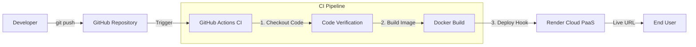

# 🚀 The Zero-Touch Pipeline (Automated CI/CD)


> **A simple proof-of-concept for a fully automated CI/CD pipeline.**

---

## 🌐 Live Demo

Check out the deployed application here:
👉 **https://devops-prototype-deployer.onrender.com/**

---

## 📖 Project Overview

### The Problem
Manual deployments are error-prone and time-consuming. "Works on my machine" is a common issue when the development environment differs from production.

### The Solution
This project implements a **"Zero-Touch" deployment strategy**. By leveraging **GitHub Actions** and **Docker**, code changes are automatically containerized and deployed to the cloud (Render). This helps avoid environment drift and reduces manual deployment steps.

---

## 🏗 Architecture Flow

The pipeline automates the workflow from code commit to deployment.



1.  **Code Push**: Developer pushes code to the `main` branch.
2.  **CI Trigger**: GitHub Actions detects the event and starts the workflow.
3.  **Build & Verify**: The code is checked out and the Docker build process is initiated to verify structural integrity.
4.  **Auto-Deployment**: Upon a successful build, the pipeline triggers a deployment to Render.

---

## 🛠 Tech Stack

-   **Containerization**: Docker (Standardizes the runtime environment)
-   **CI/CD**: GitHub Actions (Workflow automation)
-   **Application**: Python, Flask (Web Framework)
-   **Cloud Platform**: Render (PaaS for hosting)
-   **Configuration**: YAML (Pipeline definition)

---

## ✨ Key Features

-   **Dockerized Application**: Eliminates dependency conflicts by packaging the app and its environment together.
-   **Automated Workflow**: Removes the need for manual server access or manual build commands.
-   **Pipeline as Code**: The build and deploy logic is defined in `.github/workflows`, making the process version-controlled and reproducible.
-   **Build Verification**: The pipeline ensures the Docker image can be built successfully before attempting deployment.

---

## 🚀 How to Run Locally

If you want to test the application on your local machine before deploying:

### 1. Clone the Repository
```bash
git clone https://github.com/swnst/the-zero-touch-pipeline.git
cd the-zero-touch-pipeline
```

### 2. Build the Docker Image
```bash
docker build -t zero-touch-app .
```

### 3. Run the Container
```bash
docker run -p 5000:5000 zero-touch-app
```

Visit `http://localhost:5000` in your browser.

---

## 📂 Project Structure

```plaintext
.
├── .github/
│   └── workflows/
│       └── ci-cd.yml    # The CI/CD Pipeline Configuration
├── app.py               # Flask Application Entry Point
├── Dockerfile           # Docker Image Specification
├── requirements.txt     # Python Dependencies
└── README.md            # Project Documentation
```
