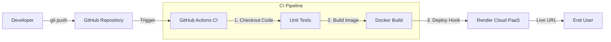

# 🚀 The Zero-Touch Pipeline (Automated CI/CD)


> **A proof-of-concept project demonstrating a fully automated Continuous Integration and Continuous Deployment (CI/CD) pipeline.**

---

## 🌐 Live Demo

Check out the deployed application here:
👉 **https://devops-prototype-deployer.onrender.com/**

---

## 📖 Project Overview

### The Problem
In traditional software development, deploying updates manually is error-prone, time-consuming, and leads to "works on my machine" issues. Manual deployments often result in downtime and inconsistent environments.

### The Solution
This project implements a **"Zero-Touch" deployment strategy**. By leveraging **GitHub Actions** and **Docker**, every code change is automatically built, tested, containerized, and deployed to the cloud (Render) without human intervention. This ensures a consistent, reliable, and fast release cycle.

---

## 🏗 Architecture Flow

The pipeline automates the workflow from code commit to production deployment.



1.  **Code Push**: Developer pushes code to the `main` branch.
2.  **CI Trigger**: GitHub Actions detects the event and starts the workflow.
3.  **Build & Test**: The code is checked out, dependencies installed, and tests run.
4.  **Containerization**: A lightweight Docker image is built.
5.  **Auto-Deployment**: Upon success, the pipeline triggers a deployment to Render.

---

## 🛠 Tech Stack

-   **Containerization**: Docker (ensures environment consistency)
-   **CI/CD**: GitHub Actions (Workflow automation)
-   **Application**: Python, Flask (Web Framework)
-   **Cloud Platform**: Render (PaaS for hosting)
-   **Infrastructure as Code**: YAML (Pipeline configuration)

---

## ✨ Key Features

-   **Containerization**: The application is fully Dockerized, eliminating dependency conflicts and ensuring the app runs exactly the same in Dev and Prod.
-   **Zero-Touch Automation**: The entire pipeline is triggered by Git events. No manual SSH or server configuration is required for updates.
-   **Infrastructure as Code (IaC)**: The build and deploy logic is defined in code (`.github/workflows`), making the pipeline version-controlled and reproducible.
-   **Automated Quality Gate**: The pipeline is configured to fail (and stop deployment) if the build steps encounter errors, preventing bad code from reaching production.

---

## 🚀 How to Run Locally

If you want to test the application on your local machine before deploying:

### 1. Clone the Repository
```bash
git clone https://github.com/swnst/the-zero-touch-pipeline
cd zero-touch-pipeline
```

### 2. Build the Docker Image
```bash
docker build -t zero-touch-app .
```

### 3. Run the Container
```bash
docker run -p 5000:5000 zero-touch-app
```

Visit `http://localhost:5000` in your browser.

---

## 📂 Project Structure

```plaintext
.
├── .github/
│   └── workflows/
│       └── ci-cd.yml    # The CI/CD Pipeline Configuration
├── app.py               # Flask Application Entry Point
├── Dockerfile           # Docker Image Specification
├── requirements.txt     # Python Dependencies
└── README.md            # Project Documentation
```
